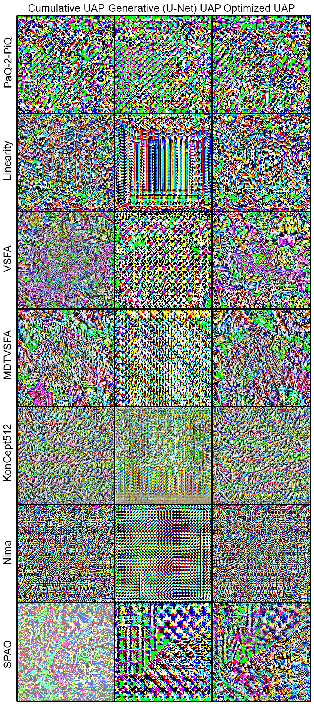

# fast-attacks-on-NR-metrics

## Code
This repository contains implementations of four fast adversarial attacks on no-reference image- and video-quality metrics.

* Cumulative UAP
[[training code](https://github.com/katiashh/fast-attacks-on-NR-metrics/blob/main/Cumulative_UAP_training.ipynb)]
[[inference code](https://github.com/katiashh/fast-attacks-on-NR-metrics/blob/main/UAP_inference.ipynb)]
* Generative UAP
[[training code](https://github.com/katiashh/fast-attacks-on-NR-metrics/blob/main/Generative_UAP_training.ipynb)]
[[inference code](https://github.com/katiashh/fast-attacks-on-NR-metrics/blob/main/UAP_inference.ipynb)]
* Optimized UAP
[[training code](https://github.com/katiashh/fast-attacks-on-NR-metrics/blob/main/Optimized_UAP_training.ipynb)]
[[inference code](https://github.com/katiashh/fast-attacks-on-NR-metrics/blob/main/UAP_inference.ipynb)]
* CNN-based
[[training code](https://github.com/katiashh/fast-attacks-on-NR-metrics/blob/main/CNN-based_training.ipynbb)]
[[inference code](https://github.com/katiashh/fast-attacks-on-NR-metrics/blob/main/CNN-based_inference.ipynb)]
[[pre-trained models](https://drive.google.com/drive/folders/1ei3WdDpSEnLmwvEVmABpBSPXygzVxobu)]

*In this code, we attacked [PaQ-2-PiQ](https://github.com/baidut/paq2piq) NR image quality metric. To attack any other NR metric, you need to change the target model.*
## UAPs visualization

*Visualizations of UAPs generated using different methods when attacking [PaQ-2-PiQ](https://github.com/baidut/paq2piq), [Linearity](https://github.com/lidq92/LinearityIQA), [VSFA](https://github.com/lidq92/VSFA), [MDTVSFA](https://github.com/lidq92/MDTVSFA), [KonCept512](https://github.com/ZhengyuZhao/koniq-PyTorch), [Nima](https://github.com/truskovskiyk/nima.pytorch/tree/v1), and [SPAQ](https://github.com/h4nwei/SPAQ).*

## Supplementary material
View [Supplementary material](https://drive.google.com/file/d/1RbGR5LYS3yba_1GhuuU8lSghZZ2YRyNt/view?usp=sharing)
